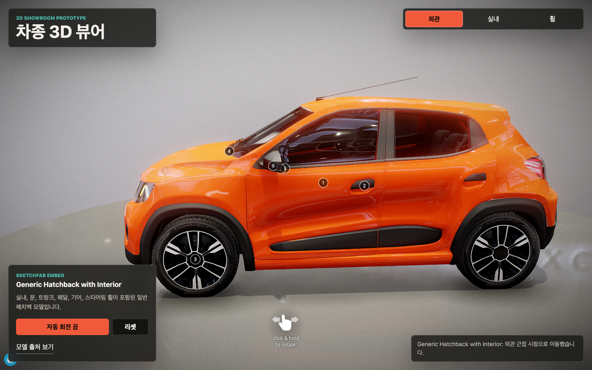

# Car 3D Showroom

실내가 포함된 차량 3D 모델을 브라우저에서 탐색하는 인터랙티브 쇼룸 프로토타입입니다. 외관·실내·휠 시점을 빠르게 전환하고, 화면 크기에 맞춘 카메라와 자동 회전으로 모델의 주요 디테일을 확인할 수 있습니다.

**[Live Demo](https://seung-won-yu.github.io/car-3d-showroom/)** · **Vanilla JavaScript** · **Sketchfab Viewer API** · **Vite**



## 한눈에 보기

| 영역 | 구현 내용 |
| --- | --- |
| 모델 탐색 | Sketchfab 임베드 모델의 회전·확대·이동 |
| 시점 전환 | 외관, 운전석 실내, 휠 annotation으로 즉시 이동 |
| 카메라 | 화면 비율에 맞춘 외관 fit과 최대 줌아웃 제한 |
| 인터랙션 | 외관 자동 회전과 사용자의 직접 조작을 함께 지원 |
| 반응형 UI | 모바일과 데스크톱에서 겹치지 않는 컨트롤 패널 |

## 주요 기능

- 외관 전체가 화면에 크게 보이도록 초기 카메라 거리를 자동 조정합니다.
- 외관·실내·휠 버튼이 실제 모델 annotation과 연결됩니다.
- 외관 시점에서 차량 주변을 천천히 도는 자동 회전을 제공합니다.
- 직접 조작을 시작하면 자동 동작과 충돌하지 않도록 상태를 전환합니다.
- 좁은 화면에서는 컨트롤과 안내 문구를 모바일 흐름으로 재배치합니다.

## 로컬 실행

Node.js가 설치된 환경에서 다음 명령을 실행합니다.

```bash
npm install
npm run dev
```

Vite가 출력한 로컬 주소에서 확인할 수 있습니다. 기본 포트는 `5173`입니다.

## 빌드

```bash
npm run build
npm run preview
```

`npm run build`는 정적 배포 파일을 `dist/`에 생성합니다.

## 배포

`main` 브랜치에 푸시하면 GitHub Actions가 Vite 프로젝트를 빌드하고 GitHub Pages에 배포합니다.

## 프로젝트 구성

```text
index.html          앱 진입점과 Sketchfab iframe
src/                쇼룸 UI와 Viewer API 제어 로직
docs/preview.png    README 미리보기
vite.config.js      개발·빌드 설정
```

## 3D 모델

쇼룸에는 Sketchfab의 [Car Generic Hatchback GameReady with interior](https://sketchfab.com/3d-models/car-generic-hatchback-gameready-with-interior-9d21deaa0174412283965baf323133a1) 모델을 사용합니다. 모델의 이용 조건은 원본 페이지의 라이선스를 따릅니다.
